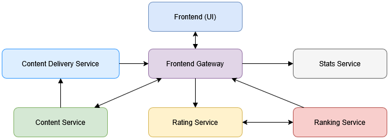

# Dokumentacja projektu Dapr - OTel

**Autorzy:**  
- Natalia Adamiak 
- Miron Czech  
- Kacper Kotkiewicz  
- Małgorzata Krupanek

**Grupa:** 2
**Rok:** 2025  

---

## Spis treści

1. [Wprowadzenie](#1-wprowadzenie)  
2. [Podstawy teoretyczne i stos technologiczny](#2-podstawy-teoretyczne-i-stos-technologiczny)  
3. [Opis koncepcji studium przypadku](#3-opis-koncepcji-studium-przypadku)  
4. [Architektura rozwiązania](#4-architektura-rozwiązania)  
5. [Opis konfiguracji środowiska](#5-opis-konfiguracji-środowiska)  
6. [Metoda instalacji](#6-metoda-instalacji)  
7. [Jak odtworzyć projekt – krok po kroku](#7-jak-odtworzyć-projekt--krok-po-kroku)  
   - [Podejście Infrastructure as Code](#71-podejście-infrastructure-as-code)  
8. [Kroki wdrożenia demonstracyjnego](#8-kroki-wdrożenia-demonstracyjnego)  
   - [Konfiguracja środowiska](#81-konfiguracja-środowiska)  
   - [Przygotowanie danych](#82-przygotowanie-danych)  
   - [Procedura wykonawcza](#83-procedura-wykonawcza)  
   - [Prezentacja wyników](#84-prezentacja-wyników)  
9. [Wykorzystanie AI w projekcie](#9-wykorzystanie-ai-w-projekcie)  
10. [Podsumowanie – wnioski](#10-podsumowanie--wnioski)  
11. [Bibliografia / Referencje](#11-bibliografia--referencje)  

---

## 1. Wprowadzenie

Celem projektu jest stworzenie prostego systemu monitoringu aplikacji webowej opartej na FastAPI, z wykorzystaniem metryk eksportowanych za pomocą OpenTelemetry (OTEL), zbieranych przez OpenTelemetry Collector, a następnie wizualizowanych w Grafanie poprzez Prometheus. Projekt demonstruje jak zintegrować Dapr z FastAPI i OTEL, aby monitorować wydajność i zachowanie aplikacji w kontenerach Docker.

---

## 2. Podstawy teoretyczne i stos technologiczny

### 2.1 Podstawy teoretyczne

**a) Dapr (Distributed Application Runtime)** to open-source framework stworzony z myślą o uproszczeniu tworzenia mikrousług. Udostępnia zestaw wbudowanych API, które ułatwiają implementację funkcjonalności niezbędnych w architekturze mikrousług, takich jak:

- komunikacja między usługami,
- zarządzanie stanem,
- obsługa zdarzeń,
- orkiestracja workflow.

Dzięki temu programiści mogą skupić się na logice biznesowej, zamiast na implementacji skomplikowanej logiki infrastrukturalnej.

Nowoczesne systemy mikrousługowe muszą być nie tylko funkcjonalne, ale też odporne na błędy i łatwe do monitorowania. W tym celu Dapr integruje się z **OpenTelemetry (OTel)** – otwartym standardem służącym do zbierania danych telemetrycznych z aplikacji rozproszonych.

**b) OpenTelemetry** to projekt rozwijany przez Cloud Native Computing Foundation (CNCF), który standaryzuje sposób zbierania i przesyłania danych telemetrycznych, takich jak:

- **Traces (śledzenie)** – dane opisujące przepływ żądań między komponentami systemu, pomocne w analizie wydajności i błędów,
- **Metrics (metryki)** – liczby opisujące stan aplikacji i infrastruktury (np. czas odpowiedzi, liczba żądań, użycie zasobów),
- **Logs (logi)** – tekstowe zapisy zdarzeń występujących w systemie.

Dzięki OTel dane mogą być eksportowane do różnych narzędzi monitorujących i analizujących, takich jak Prometheus, Grafana czy Jaeger, co pozwala uzyskać pełen obraz działania systemu.

**c) Obserwowalność z użyciem Dapr i OTel**

Dapr automatycznie generuje dane telemetryczne i przekazuje je zgodnie ze standardem OpenTelemetry. Ułatwia to monitorowanie systemu bez konieczności ręcznej integracji narzędzi do logowania, metryk i śledzenia zapytań.


---

### 2.2 Stos technologiczny

- FastAPI — nowoczesny framework do tworzenia API w Pythonie.

- Dapr — framework do budowania aplikacji mikroserwisowych z funkcjami takimi jak obserwowalność.

- OpenTelemetry (OTEL) — zestaw SDK do zbierania metryk i śledzeń.

- OpenTelemetry Collector — pośrednik odbierający metryki/traces i eksportujący je do Prometheusa.

- Prometheus — system do monitoringu i alertowania oparty na metrykach.

- Grafana — narzędzie do wizualizacji i analizy danych metrycznych.

- Docker Compose — orkiestracja kontenerów.

---

## 3. Opis koncepcji studium przypadku

Studium przypadku przedstawia prostą aplikację FastAPI działającą w kontenerze z instrumentacją OTEL do generowania metryk. Metryki są eksportowane do OpenTelemetry Collector, który przetwarza dane i eksponuje je jako endpoint Prometheusa. Prometheus scrapuje metryki z OTEL Collectora, a Grafana wizualizuje je na dashboardzie. Dapr jest użyty do wspierania zarządzania konfiguracją i integracji OTEL.

---

## 4. Architektura rozwiązania

Jokes to aplikacja zbudowana w architekturze mikroserwisowej, umożliwiająca anonimowe przeglądanie, ocenianie oraz rankingowanie żartów i memów. Składa się z sześciu niezależnych serwisów:

- Content Service – zarządza bazą żartów i memów oraz udostępnia je losowo lub w formie rankingu.

- Rating Service – umożliwia użytkownikom ocenianie treści (np. pozytywnie lub negatywnie) i przechowuje dane o głosach.

- Ranking Service – generuje listę najlepiej ocenianych treści na podstawie danych z Rating Service.

- Stats Service – zbiera podstawowe statystyki, takie jak liczba ocen dziennie lub liczba przeglądanych treści.

- Content Delivery Service – odpowiada za serwowanie obrazków memów, jeśli są przechowywane lokalnie lub w chmurze.

- Frontend Gateway – pełni rolę API Gateway i pośrednika pomiędzy frontendem a mikroserwisami, agregując dane w jednolitym formacie.

Wszystkie serwisy komunikują się między sobą za pośrednictwem REST API. Aplikacja nie wymaga logowania ani kont użytkowników – działa całkowicie anonimowo.

Poniżej zaprezentowano diagram architektury:


---

## 5. Opis konfiguracji środowiska

Środowisko składa się z następujących komponentów działających w kontenerach Docker, połączonych w jedną wspólną sieć:

- FastAPI z Dapr – aplikacja webowa, która realizuje logikę biznesową oraz integruje się z Dapr. Dapr automatycznie zbiera metryki runtime oraz udostępnia API do wysyłania własnych metryk.

- OpenTelemetry Collector (OTEL Collector) – odbiera metryki (w tym niestandardowe) z aplikacji i Dapr, przetwarza je i przekazuje dalej.

- Prometheus – system monitorowania i zbierania metryk, który scrapuje metryki z OTEL Collectora.

- Grafana – narzędzie do wizualizacji danych, które pobiera metryki z Prometheusa i pozwala na tworzenie dashboardów.

Wszystkie usługi działają w jednej sieci Docker, dzięki czemu mogą się ze sobą komunikować za pomocą nazw kontenerów jako hostów.

### Schemat komunikacji

```
[FastAPI + Dapr] --(metryki OTLP)--> [OpenTelemetry Collector] --(scrape)--> [Prometheus] --> [Grafana]
          \                                          /
           \------(metryki runtime Dapr)------------/

```

- FastAPI wysyła własne metryki do OTEL Collectora przez protokół OTLP gRPC.

- Dapr eksportuje swoje metryki runtime do OTEL Collectora.

- OTEL Collector agreguje metryki i udostępnia je na endpointzie HTTP, który jest scrappowany przez Prometheusa.

- Grafana łączy się z Prometheusem i wyświetla dane w formie wykresów i dashboardów.

---

## 6. Metoda instalacji

Przed rozpoczęciem upewnij się, że masz zainstalowane następujące narzędzia:

- [Dapr CLI](https://docs.dapr.io/getting-started/install-dapr-cli/) – interfejs wiersza poleceń do zarządzania Dapr.
- **Docker**
- **Python 3** 

---

## 7. Jak odtworzyć projekt – krok po kroku
W celu uruchomieniu usług z Dapr mamy dwie możliwości: uruchomienie każdego serwisu po kolei jak przedstawiono w punkcie 7.1 lub skorzystanie z polecania z punktu 7.4, który odpali wszystkie za jednym razem.

### 7.0 Inicjalizacja zależności

- Uruchom Dockera
- Wykonaj komendę:
   ```sh
   dapr init
   ```
- w folderze projektu zainstaluj package do pythona
   ```sh
   pip install -r requirements.txt
   ```
- w folderze projektu wykonaj następujące komendy by zainicjalizować aplikację frontendową
   ```sh
   cd jokes-frontend
   npm install
   ```

### 7.1 Uruchamianie usług z Dapr

#### Content Service

Aby uruchomić Content Service z użyciem Dapr:

```sh
dapr run --app-id content-service --app-port 8001 -- uvicorn jokes-app.content_service:app --host 0.0.0.0 --port 8001
```

Usługa będzie dostępna pod adresem:

http://localhost:8001/jokes

#### Rating Service

Aby uruchomić Rating Service z użyciem Dapr:

```sh
dapr run --app-id rating-service --app-port 8002 -- uvicorn jokes-app.rating_service:app --host 0.0.0.0 --port 8002
```

Usługa będzie dostępna pod adresem:

- POST http://localhost:8002/rate/{joke_id} (z ciałem JSON: `{"rating": <int>}`)
- GET  http://localhost:8002/rating/{joke_id}

#### Ranking Service

Aby uruchomić Ranking Service z użyciem Dapr:

```sh
dapr run --app-id ranking-service --app-port 8003 -- uvicorn jokes-app.ranking_service:app --host 0.0.0.0 --port 8003
```

Usługa będzie dostępna pod adresem:

http://localhost:8003/ranking

#### Stats Service

Aby uruchomić Stats Service z użyciem Dapr:

```sh
dapr run --app-id stats-service --app-port 8004 -- uvicorn jokes-app.stats_service:app --host 0.0.0.0 --port 8004
```

Usługa będzie dostępna pod adresem:

- POST http://localhost:8004/stats/rating  
- POST http://localhost:8004/stats/view  
- GET  http://localhost:8004/stats

#### Content Delivery Service

Aby uruchomić Content Delivery Service z użyciem Dapr:

```sh
dapr run --app-id content-delivery-service --app-port 8005 -- uvicorn jokes-app.content_delivery_service:app --host 0.0.0.0 --port 8005
```

Usługa będzie dostępna pod adresem:

- POST http://localhost:8005/upload (multipart/form-data, pole: `file`)  
- GET  http://localhost:8005/media/{filename}

#### Frontend Gateway

Aby uruchomić Frontend Gateway z użyciem Dapr:

```sh
dapr run --app-id frontend-gateway --app-port 8006 -- uvicorn jokes-app.frontend_gateway:app --host 0.0.0.0 --port 8006
```

Usługa będzie dostępna pod adresem:

- GET http://localhost:8006/jokes/full  
- GET http://localhost:8006/health

### 7.2 Uruchamianie aplikacji frontendowej

Aby uruchomić aplikację frontendową należy wykonać komendy:

```sh
cd jokes-frontend
npm start
```

### 7.3 Uruchamienie monitoringu

W celu uruchomienia kontenerów z Grafaną, Prometheusem oraz OTel (OpenTelemetry Collector), przejdź do folderu `metrics` i uruchom następujące polecenie:

```bash
docker-compose up
```

### 7.4 Podejście Infrastructure as Code

Serwisy korzystające z Dapr można uruchomić za pomocą komendy:
```
dapr run -f .
```

---

## 8. Kroki wdrożenia demonstracyjnego

### 8.1 Konfiguracja środowiska

Konfiguracja środowiska została opisana w punktach [6](#6-metoda-instalacji) i [7.0](#7-0-inicjalizacja-zaleznosci)

### 8.2 Przygotowanie danych

W folderze `grafana-dashboards` znajdują się gotowe pliki konfiguracyjne w formacie JSON, przeznaczone do importu w Grafanie. Każdy z plików reprezentuje osobny dashboard, umożliwiający monitorowanie i analizę metryk powiązanych z projektem.

### 8.3 Procedura wykonawcza

Aby uruchomić cały projekt w sposób uporządkowany, wykonaj następujące kroki:

1. Upewnij się, że zainstalowałeś [niezbędne narzędzia](#6-metoda-instalacji).
2. Zaincjalizuj [zależności projektu](#7-0-inicjalizacja-zaleznosci), jeżeli nie zrobiłeś tego wcześniej.
3. Uruchom [aplikację frontendową](#7-2-uruchamianie-aplikacji-frontendowej).
4. Uruchom [monitoring (Grafana, Prometheus, OTel)](#7-3-uruchomienie-monitoringu).
5. Uruchom [serwisy z Dapr za pomocą podejścia Infrastructure as Code](#7-4-podejscie-infrastructure-as-code).

Aby skorzystać z gotowych dashboardów:
1. Otwórz panel Grafana.
2. Przejdź do **Dashboards > Import**.
3. Wskaż plik JSON z folderu `grafana-dashboards` lub wklej jego zawartość.
4. Zapisz dashboard i skonfiguruj źródło danych, jeśli to konieczne.

### 8.4 Prezentacja wyników

### Działająca aplikacja frontendowa
a) **Ekran przeglądu i oceny żartów**


b) **Ekran rankingu żartów**


###  Wybrane dashboardy

🔹 **Dashboard: Requests per endpoint**

Ten dashboard prezentuje liczbę żądań (requests) dla różnych endpointów w systemie. Wykorzystuje metryki Prometheusa:

```
content_requests_total, delivery_requests_total, gateway_requests_total, ranking_requests_total, rating_requests_total, stats_requests_total
```

Wizualizuje dane w formie wykresu kołowego, pozwalając szybko zidentyfikować obciążenie poszczególnych endpointów.


Aby zaimportować ten dashboard, użyj pliku JSON o identyfikatorze:
```
0900e16d-3e55-4138-8a48-2ab97f74157a
```
🔹 **Dashboard: Server duration milliseconds sum**

Ten dashboard monitoruje sumaryczny czas obsługi żądań w milisekundach, wykorzystując metrykę Prometheusa:

```
http_server_duration_milliseconds_sum
```

Prezentuje dane w formie wykresu czasowego (Time Series), umożliwiając analizę wydajności serwera w ostatnich 15 minutach.


Dashboard jest zapisany w pliku JSON o identyfikatorze:
```
242f4221-44b3-4558-abd4-bead72f382e8
```

---


## 9. Wykorzystanie AI w projekcie

*TO DO*

---

## 10. Podsumowanie – wnioski

*TO DO*

---

## 11. Bibliografia / Referencje

*TO DO*

---

